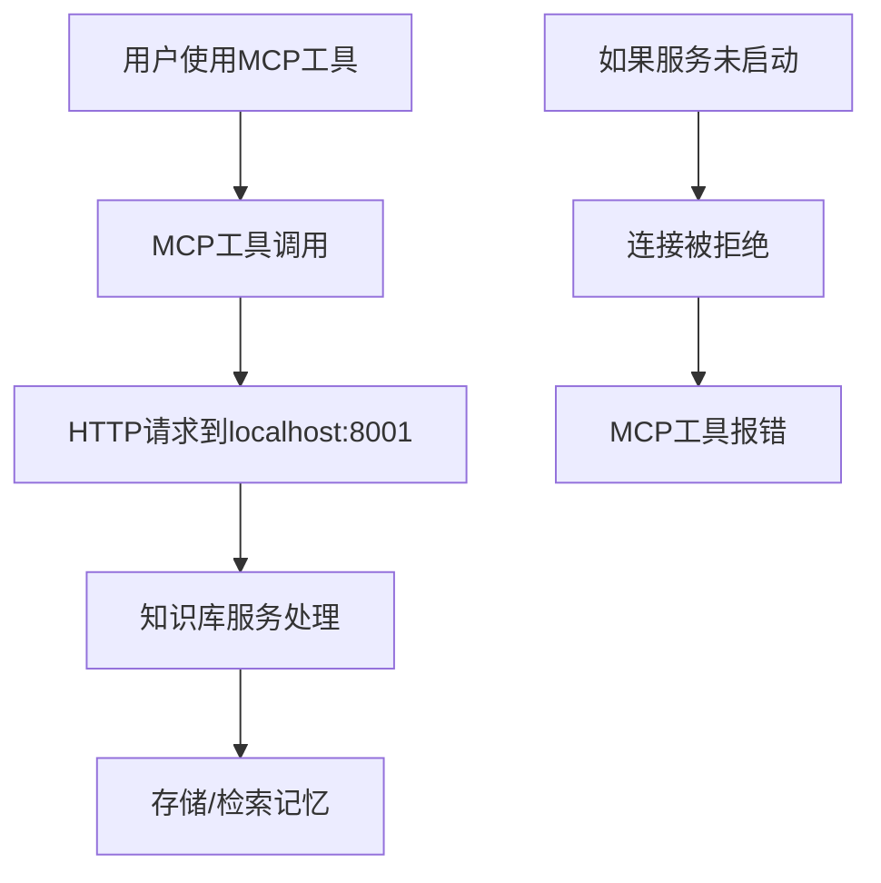

# MCP记忆系统架构说明

## 🏗️ 为什么需要独立的记忆库服务？

### 架构演进对比

#### 旧方案：文件存储方式
```
MCP 工具 → 直接读写文件 → vectors.npy + documents.json
```
- ✅ 简单直接，无需额外服务
- ❌ 并发访问问题
- ❌ 无法提供API接口
- ❌ 缺乏数据验证和安全控制

#### 新方案：HTTP服务架构
```
MCP 工具 → HTTP API → 记忆库服务 → 数据存储
```
- ✅ 支持并发访问
- ✅ 标准HTTP API接口
- ✅ 数据验证和安全控制
- ✅ 可扩展和监控
- ✅ 支持用户隔离

## 🔄 服务启动流程

### 必要的启动顺序

1. **知识库HTTP服务** (端口8001)
   - 提供记忆存储和检索API
   - 处理embedding计算和向量存储
   - 必须首先启动

2. **MCP工具服务**
   - 通过HTTP调用知识库服务
   - 依赖知识库服务运行

### 为什么必须先启动记忆库？



## 🛠️ 启动脚本说明

### 主要启动脚本

1. **start_mcp_services.sh** - 基础启动脚本
2. **manage_linux_services.sh** - 完整服务管理脚本 (推荐)
3. **deploy.sh** - 一键部署脚本

### 推荐使用方式

```bash
# 方式1: 使用完整管理脚本 (推荐)
./manage_linux_services.sh start

# 方式2: 使用基础启动脚本
./start_mcp_services.sh

# 方式3: 一键部署
./deploy.sh
```

## 🐛 常见启动问题及解决方案

### 1. "知识库服务启动失败"

**可能原因:**
- 端口配置不一致 (8000 vs 8001)
- Python依赖包缺失
- 权限问题
- 端口被占用

**解决步骤:**
```bash
# 检查端口配置
grep -r "8001" configs/

# 检查Python依赖
python3 -c "import fastapi, uvicorn, numpy, requests"

# 检查端口占用
netstat -tlnp | grep 8001

# 查看详细错误
tail -f /root/logs/knowledge_base_http.log
```

### 2. "Connection refused localhost:8001"

**原因:** 知识库服务未正确启动

**解决:**
```bash
# 重启服务
./manage_linux_services.sh restart

# 检查服务状态
./manage_linux_services.sh status

# 测试连接
curl http://localhost:8001/docs
```

### 3. Python包导入错误

**解决:**
```bash
# 安装依赖
pip3 install fastapi uvicorn numpy requests python-multipart

# 或使用requirements.txt
pip3 install -r requirements.txt
```

## 📊 服务健康检查

### 检查服务是否正常运行

```bash
# 1. 检查进程
ps aux | grep knowledge_base_service

# 2. 检查端口
netstat -tlnp | grep 8001

# 3. 测试API
curl http://localhost:8001/docs
curl http://localhost:8001/stats

# 4. 使用管理脚本
./manage_linux_services.sh status
./manage_linux_services.sh test
```

### 查看服务日志

```bash
# 实时查看日志
tail -f /root/logs/knowledge_base_http.log

# 查看错误日志
grep -i error /root/logs/knowledge_base_http.log

# 使用管理脚本
./manage_linux_services.sh logs
```

## 🚀 生产环境最佳实践

### 1. 使用进程管理器

**Systemd服务配置** (`/etc/systemd/system/mcp-memory.service`):
```ini
[Unit]
Description=MCP Memory Knowledge Base Service
After=network.target

[Service]
Type=simple
User=root
WorkingDirectory=/root/mcp_database
Environment=KB_PORT=8001
Environment=PYTHONPATH=/root/mcp_database
ExecStart=/usr/bin/python3 knowledge_base_service.py
Restart=always
RestartSec=10

[Install]
WantedBy=multi-user.target
```

启用服务:
```bash
systemctl enable mcp-memory
systemctl start mcp-memory
systemctl status mcp-memory
```

### 2. 监控和告警

```bash
# 创建监控脚本
cat > /root/check_mcp_health.sh << 'EOF'
#!/bin/bash
if ! curl -s http://localhost:8001/stats > /dev/null; then
    echo "MCP服务异常" | mail -s "MCP告警" admin@example.com
    systemctl restart mcp-memory
fi
EOF

# 添加到crontab
echo "*/5 * * * * /root/check_mcp_health.sh" | crontab -
```

### 3. 日志轮转

```bash
# 配置logrotate
cat > /etc/logrotate.d/mcp-memory << 'EOF'
/root/logs/knowledge_base_http.log {
    daily
    rotate 7
    compress
    delaycompress
    missingok
    notifempty
    copytruncate
}
EOF
```

## 🔧 故障排除清单

当遇到启动问题时，按以下顺序检查：

1. **环境检查**
   ```bash
   ./check_linux_env.sh
   ```

2. **配置验证**
   ```bash
   python3 validate_mcp_config.py
   ```

3. **手动启动测试**
   ```bash
   cd /root/mcp_database
   export KB_PORT=8001
   python3 knowledge_base_service.py
   ```

4. **依赖检查**
   ```bash
   python3 -c "import fastapi, uvicorn, numpy, requests; print('所有依赖正常')"
   ```

5. **端口检查**
   ```bash
   netstat -tlnp | grep 8001
   ```

6. **日志分析**
   ```bash
   tail -f /root/logs/knowledge_base_http.log
   ```

---

**记住**: 新的embedding记忆系统需要HTTP服务支持，这与之前的文件存储方式不同。服务启动是使用记忆功能的前提条件。
