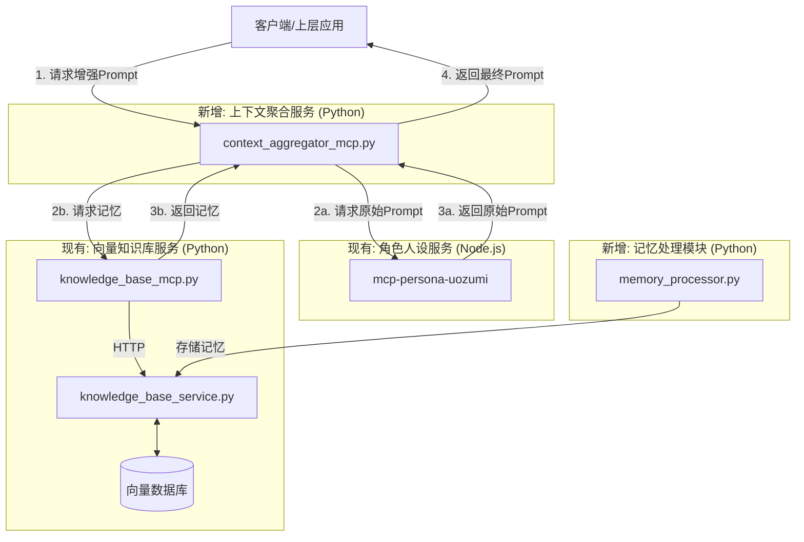

## 大模型记忆与上下文管理系统 设计文档

### 1. 系统目标

本系统旨在为基于 MCP 架构的 AI 应用集成长期记忆能力。核心目标是在**不侵入现有角色人设服务**的前提下，通过一个独立的**上下文聚合服务**，动态地将用户的历史记忆和相关知识注入到对话上下文中，从而提升 AI 交互的连贯性、个性化和准确性。

### 2. 核心设计原则

*   **关注点分离 (SoC)**: 每个服务职责单一。角色服务负责人设，知识库负责数据，聚合服务负责编排。
*   **零侵入性**: 现有角色人设服务（`mcp-persona-*`）的代码和数据文件**无需任何修改**。
*   **可扩展性**: 架构应能轻松支持未来引入新的上下文源（如实时天气、新闻API等）。
*   **数据复用**: 复用现有的向量知识库服务来存储和检索“记忆”，将其视为一种带特殊元数据的文档。

### 3. 系统架构图



### 4. 工程结构变更

在现有项目基础上，新增 `context_aggregator_mcp.py` 和 `memory_processor.py`。

```
mcp_database/
├── 🎭 角色人设服务 (Persona Services)
│   └── mcp-persona-uozumi/         # [无变更]
├── 🗄️ 向量知识库服务 (Knowledge Base)
│   ├── knowledge_base_service.py       # [无变更]
│   └── knowledge_base_mcp.py           # [无变更]
├── 🧠 记忆处理服务 (Memory Processing) [新增模块]
│   └── memory_processor.py             # [新增] 负责从对话中提取、评估和存储记忆
├── 📦 上下文聚合服务 (Context Aggregation) [新增模块]
│   └── context_aggregator_mcp.py       # [新增] 负责编排和拼接Prompt
└── ...
```

### 5. 核心组件详细设计

#### 5.1. 向量知识库服务 (`knowledge_base_service.py` & `knowledge_base_mcp.py`)

**状态**: **无变更**。该服务继续提供底层的文档添加和搜索能力。记忆系统将通过以下方式复用其功能：

*   **记忆存储**: 调用 `add_document` 工具，将记忆内容作为文档存入。
*   **记忆检索**: 调用 `search_documents` 工具，通过特定的**标签（Tag）**和**元数据（Metadata）**来精确检索记忆。

#### 5.2. 记忆处理服务 (`memory_processor.py`) [新增]

**类型**: Python 模块（非 MCP 服务）。
**职责**: 提供将非结构化对话转化为结构化记忆的业务逻辑。

```python
# file: memory_processor.py

class MemoryProcessor:
    def __init__(self, llm_api_key: str, kb_service_url: str):
        """
        :param llm_api_key: 用于调用 LLM 的 API Key。
        :param kb_service_url: 知识库 HTTP 服务的 URL (e.g., http://localhost:8000)。
        """
        pass

    def extract_and_rate_memory(self, conversation_history: str) -> dict | None:
        """
        调用大语言模型从对话历史中提取单条记忆并进行重要性评分。
        返回格式: {"summary": "记忆内容", "importance": 8.5}
        """
        pass

    def save_memory(self, user_id: str, content: str, importance: float) -> bool:
        """
        将提取的记忆内容通过 HTTP API 保存到知识库。
        核心逻辑:
        1. 构建 payload，调用知识库的 /add 接口。
        2. 'tags' 字段必须包含 "memory"。
        3. 'metadata' 字段必须包含 {"user_id": user_id, "importance": importance}。
        """
        pass
```

#### 5.3. 上下文聚合服务 (`context_aggregator_mcp.py`) [新增]

**类型**: Python MCP stdio 服务。
**职责**: 作为应用与 MCP 服务集群交互的**唯一入口**，负责动态构建最终的 System Prompt。

```python
# file: context_aggregator_mcp.py
import asyncio
import mcp

@mcp.tool()
async def build_prompt_with_context(
    persona_name: str, 
    user_id: str, 
    user_query: str,
    memory_top_k: int = 3
) -> str:
    """
    动态构建一个包含长期记忆和角色人设的系统提示。

    :param persona_name: 角色名称 (e.g., 'uozumi')。
    :param user_id: 用户唯一标识符。
    :param user_query: 用户当前的查询，用于记忆相关性搜索。
    :param memory_top_k: 检索记忆的数量。
    :return: 组装完成的最终 System Prompt 字符串。
    """
    # 1. 并行获取原始Prompt和记忆
    original_prompt_task = mcp.call_tool(
        f"persona-{persona_name}", 
        f"get_{persona_name}_system_prompt" 
    )

    memory_task = mcp.call_tool(
        "knowledge-base", 
        "search_documents",
        {
            "query": user_query, 
            "tags": ["memory"], # 关键：通过标签筛选记忆
            "metadata_filter": {"user_id": user_id}, # 关键：通过元数据确保用户隔离
            "top_k": memory_top_k
        }
    )
    
    original_prompt, memories = await asyncio.gather(original_prompt_task, memory_task)

    # 2. 格式化记忆内容
    memory_section = _format_memories_as_supplement(memories)

    # 3. 智能拼接
    if memory_section:
        return f"{memory_section}\n\n---\n\n{original_prompt}"
    else:
        return original_prompt

def _format_memories_as_supplement(memories: list) -> str:
    """将记忆列表格式化为一段补充说明文本。"""
    if not memories or not isinstance(memories, list):
        return ""
        
    memory_items = "\n".join([f"- {mem.get('content', '')}" for mem in memories])
    
    return f"""[补充记忆上下文]
关于这位用户，请参考以下你之前的记忆：
{memory_items}
"""
```
**注意**: 在调用 `search_documents` 时，需要确保知识库的 MCP 包装器和 HTTP 服务支持 `metadata_filter` 参数。如果不支持，需要进行少量修改以实现该功能。

### 6. 部署与配置

#### 6.1. MCP 客户端配置 (`mcp_config.json`)

必须添加新的 `context-aggregator` 服务。

```json
{
  "mcpServers": {
    "persona-uozumi": {
      "command": "node",
      "args": ["./mcp-persona-uozumi/dist/server.js"],
      "cwd": "/path/to/mcp_database"
    },
    "knowledge-base": {
      "command": "python",
      "args": ["knowledge_base_mcp.py"],
      "cwd": "/path/to/mcp_database"
    },
    "context-aggregator": {
      "command": "python",
      "args": ["context_aggregator_mcp.py"],
      "cwd": "/path/to/mcp_database"
    }
  }
}
```

### 7. 安全与隐私

*   **数据隔离**: 系统的安全基石。所有记忆的存储和检索**必须**通过 `user_id` 在元数据中进行严格隔离。
*   **访问控制**: 上层应用应只与 `context-aggregator` 服务通信，避免直接访问底层服务，以统一管理安全策略。

### 8. 实施流程

1.  **实现 `MemoryProcessor`**: 编写 `memory_processor.py`，重点是设计好调用 LLM 提取记忆的 Prompt。
2.  **实现 `ContextAggregator`**: 编写 `context_aggregator_mcp.py`，实现 `build_prompt_with_context` 工具的核心编排逻辑。
3.  **确认知识库接口**: ✅ **已完成** - 确保 `knowledge_base` 服务支持基于 `metadata` 的过滤。
4.  **更新部署配置**: 将新服务加入 `mcp_config.json`。
5.  **集成与测试**: 修改上层应用，使其调用新的聚合服务来获取 Prompt，并进行端到端测试。

---